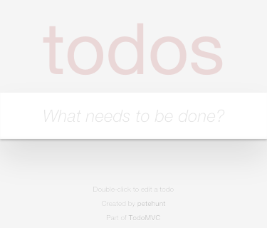
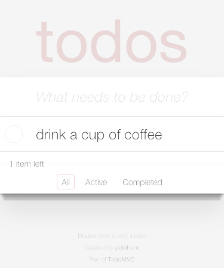
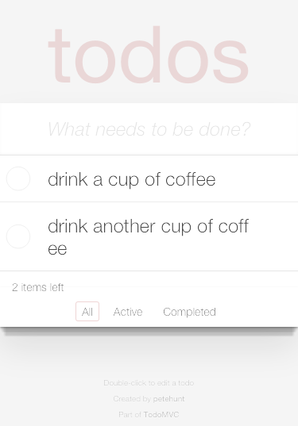
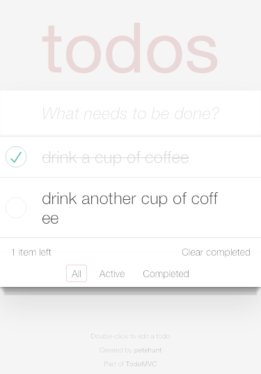
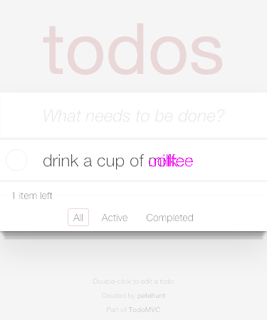

# vbot
A visual regression testing tool, aims to help developers quickly create tests with minimum overhead, avoid repeated clicks and typings in testings, particularly helpful for single page applications or complicated web app. Automate the testings "headlessly" at local dev environment or on a continuous integration server.

There is a [blog post](http://katat.github.io/2017/01/09/vbot/) discussing about the motivation behind `vbot`.

## Install
`npm install -g vbot`

## Schema
**viewHeight**
height of the browser view

**viewWidth**
width of the browser view

**captureSelector**
Element to be captured in screenshot. All the screenshots in a schema is capturing the same element. It is recommend to test against the whole page view, so is the `html`. However it is allowed to target any elements in the view, such as `body` or `.css-selector`.

**host**
The global host of for the test url path in the scenarios

**scenarios**
Each scenario can comprise of a set of actions in the page view. It groups a set of cohesive tests.
 - **path**  
 The url path for the scenario test to begin with
 - **captureDelay**  
 Delay(millisecond) to wait before take the final scenario screenshot. For the purpose of avoiding taking screenshot during the page animation. Apply to all the actions.
 - **hideElements**  
 Exclude the DOM elements when taking screenshots.
 - **localStorage**  
 Preset localStorage values before the actions taking place.
 ```
 [{"key": "key", "value": true}]
 ```

 - **actions**  
 A set of test steps
   - **type**  
   Action Type: `assert`, `click`, `enter`, `scrollTo`
   - **waitFor**  
   Wait for the element to exist before proceeding to the action type. It is the target element regarding to the action.
   - **waitTimeout**  
   Maximum time to wait for the element `waitFor` exists in the DOM. If waited longer than this setting, it throws error of not found the `waitFor` element.
   - **shot**  
   Take screenshot before this step action is executed.
   - **captureDelay**  
   Delay(millisecond) to wait before this step's screenshot is taken. Apply only to an individual action.
   - **position**  
   The [x, y] position to scroll to, when using action type `scrollTo`.
   - **enter**
   Set `true` to simulate `enter` press key to a input field.

### Example

Let's take a look at how vbot can ease the VRT process. Suppose we want to test this [TODO](http://todomvc.com/examples/react) web app using vbot. We define the interaction flow in a JSON file as below:

```
{
    "viewWidth": 375,
    "viewHeight": 677,
    "captureSelector": "html",
    "host": "http://todomvc.com",
    "scenarios": [
        {
            "name": "todo test",
            "path": "/examples/react",
            "actions": [
                {
                    "type": "assert",
                    "waitFor": ".new-todo",
                    "shot": true,
                    "comment": "wait for the input element .new-todo appear and take a screenshot"
                },{
                    "type": "enter",
                    "waitFor": ".new-todo",
                    "value": "drink a cup of coffee",
                    "enter": true,
                    "comment": "enter task message and press 'enter' key"
                },{
                    "type": "assert",
                    "waitFor": "ul.todo-list li:nth-child(1)",
                    "shot": true,
                    "comment": "make sure there is a newly created task in the list and take screenshot"
                },{
                    "type": "enter",
                    "waitFor": ".new-todo",
                    "value": "drink another cup of coffee",
                    "enter": true,
                    "comment": "create second task"
                },{
                    "type": "assert",
                    "waitFor": "ul.todo-list li:nth-child(2)",
                    "shot": true,
                    "comment": "ensure the second task is created"
                },{
                    "type": "click",
                    "waitFor": "ul.todo-list li:nth-child(1) .toggle",
                    "comment": "mark the first task as completed"
                },{
                    "type": "assert",
                    "waitFor": "ul.todo-list li.completed:nth-child(1)",
                    "shot": true,
                    "commend": "ensure the completed status is reflected in the view and take screenshot"
                }
            ]
        }
    ]
}

```

Suppose this test definition is store in `test.json` file. To execute the tests, run the command below.

`vbot --f=test.json`

vbot will execute the actions defined in the test.json, the schema file,  taking screenshots which will be compared in the end. All the screenshot taken will be in folders, `screenshots` and `results`.

The `screenshots` is the based image folder, while the `results` have the comparison result images. To rebase the images, use `rebase` flag, such as `vbot --f=test.json --rebase`, the images in the `screenshots` folder will be refreshed.

In addition to the screenshots, it prints out the testings reports at the end of the tests, showing which tests passed or failed with a mismatch percentage compared with the baseline.

## Screenshots
Below are the screenshots captured during the interaction flow:

------------

```
{
    "type": "assert",
    "waitFor": ".new-todo",
    "shot": true,
    "comment": "wait for the input element .new-todo appear and take a screenshot"
}
```


-------------
```
{
    "type": "enter",
    "waitFor": ".new-todo",
    "value": "drink a cup of coffee",
    "enter": true,
    "comment": "enter task message and press 'enter' key"
},{
    "type": "assert",
    "waitFor": "ul.todo-list li:nth-child(1)",
    "shot": true,
    "comment": "make sure there is a newly created task in the list and take screenshot"
}
```


--------------
```
{
    "type": "enter",
    "waitFor": ".new-todo",
    "value": "drink another cup of coffee",
    "enter": true,
    "comment": "create second task"
},{
    "type": "assert",
    "waitFor": "ul.todo-list li:nth-child(2)",
    "shot": true,
    "comment": "ensure the second task is created"
}
```


---------------
```
{
    "type": "click",
    "waitFor": "ul.todo-list li:nth-child(1) .toggle",
    "comment": "mark the first task as completed"
},{
    "type": "assert",
    "waitFor": "ul.todo-list li.completed:nth-child(1)",
    "shot": true,
    "commend": "ensure the completed status is reflected in the view and take screenshot"
}
```


------------

If this is the first time vbot run the tests for this JSON definition file, the images generated are the baselines. The subsequent tests will compare the newly generated image file with the baselines and highlight the differences if it is not 100% match. For example, let's change the action definition below:

```
{
    "type": "enter",
    "waitFor": ".new-todo",
    "value": "drink a cup of coffee",
    "enter": true
}
```

to

```
{
    "type": "enter",
    "waitFor": ".new-todo",
    "value": "drink a cup of milk",
    "enter": true
}
```

After re-run the command line above, it should report there is test result mismatch the baseline and generated a image that highlights the difference:

------------------



------------------
## Welcome contributions

Fork and make changes. In the tests directory, run `./test.sh` to make sure all the tests are passed. Welcome pull requests or request new features.
